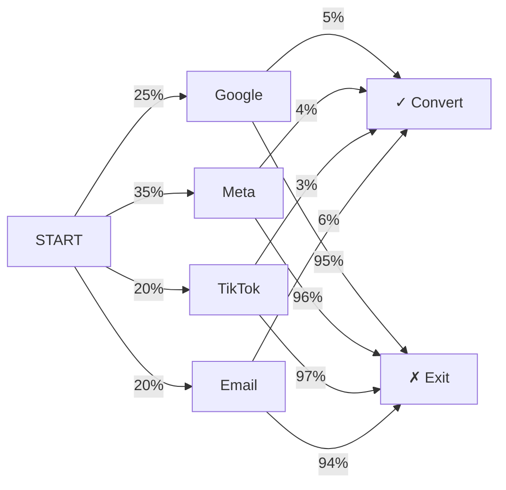
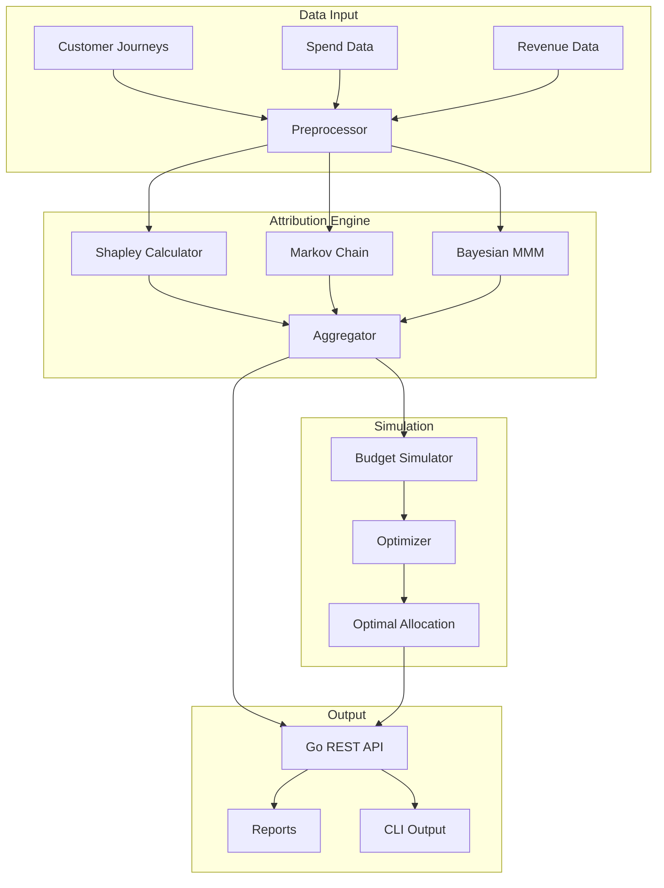

<div align="center">

# 📊 Attributor

**Multi-touch marketing attribution & media mix modeling** — quantify every channel's contribution to conversions using **Shapley values**, **Markov chains**, and **Bayesian MCMC** — then simulate budget reallocations for maximum ROAS.

[](https://github.com/Crynge/Attributor/actions/workflows/ci.yml)
[](https://go.dev)
[](LICENSE)
[](https://github.com/Crynge/Attributor)
[](https://github.com/Crynge/Attributor/commits/main)
[](https://github.com/Crynge/Attributor)

[Attribution Models](#-attribution-models) • [Quick Start](#quick-start) • [Architecture](#architecture) • [API](#api) • [Modules](#modules) • [Contributing](#contributing)

---

> **⭐ Maximizing marketing ROI?** Star Attributor to support open-source attribution!

</div>

---

## 📐 Attribution Models

### Shapley Value

$$ \phi_i(v) = \sum_{S \subseteq N \setminus \{i\}} \frac{|S|! (|N| - |S| - 1)!}{|N|!} \left( v(S \cup \{i\}) - v(S) \right) $$

Measures the **marginal contribution** of each channel across all possible channel combinations — the only attribution method that satisfies **symmetry, linearity, and efficiency**.

| Channel | Shapley Value | Share |
|---|---|---|
| Google Search | 34.2% | ████████████████ |
| Meta Ads | 28.7% | ██████████████ |
| TikTok | 22.1% | ██████████ |
| Email | 15.0% | ███████ |

### Markov Chain



**Removal effect**: Remove a channel → measure drop in conversion probability. The channel with the largest drop gets the most credit.

### Bayesian MMM

$$ y_t = \beta_0 + \sum_{ch} \beta_{ch} \cdot f(x_{ch,t}) + \gamma \cdot z_t + \varepsilon_t $$

**Media mix model** using Hamiltonian Monte Carlo with:
- **Adstock transformations** — advertising effects carry over across weeks
- **Saturation curves** — diminishing returns modeled via Hill functions
- **Uncertainty intervals** — **90% credible intervals** for every parameter

---

## Quick Start

```bash
# Shapley attribution
attributor attrib shapley --journeys journeys.json

# Markov chain attribution
attributor attrib markov --journeys journeys.json

# Fit MMM model
attributor mmm fit --data spend_revenue.csv --output model.json

# Budget simulation
attributor simulate --budget 500000 --reallocate
```

```go
import "github.com/Crynge/Attributor/internal/attribution"

// Shapley
shapley := attribution.NewShapleyCalculator()
result := shapley.Compute(journeys)
for ch, val := range result.Attributions {
    fmt.Printf("%s: %.1f%%\n", ch, val*100)
}

// Markov
markov := attribution.NewMarkovChainCalculator()
result = markov.Compute(journeys)
for ch, val := range result.Attributions {
    fmt.Printf("%s: %.1f%%\n", ch, val*100)
}
```

---

## Architecture



---

## API

```bash
# Shapley attribution
curl -X POST http://localhost:8080/api/v1/attribution/shapley \
  -H "Content-Type: application/json" \
  -d '{"journeys": [...], "channels": ["google", "meta", "tiktok"]}'

# Markov attribution
curl -X POST http://localhost:8080/api/v1/attribution/markov \
  -d '{"journeys": [...], "conversion_event": "purchase"}'

# Fit MMM
curl -X POST http://localhost:8080/api/v1/mmm/fit \
  -d '{"data": [...], "model": "hill_adstock"}'

# Budget simulation
curl -X POST http://localhost:8080/api/v1/simulate \
  -d '{"budget": 500000, "channels": ["google", "meta", "tiktok"]}'
```

---

## Modules

```
cmd/
└── attributor/
    └── main.go                 # CLI entrypoint

internal/
├── api/
│   └── server.go               # REST API
├── attribution/
│   ├── models.go               # Data models
│   ├── shapley.go              # Shapley value calculation
│   └── markov.go               # Markov chain attribution
├── mmm/
│   ├── model.go                # MMM model definition
│   └── mcmc.go                 # Bayesian MCMC sampler
├── journey/
│   └── journey.go              # Customer journey processing
├── simulation/
│   └── sim.go                  # Budget simulation engine
└── reporting/
    └── report.go               # Report generation
```

---

## Contributing

See [CONTRIBUTING.md](CONTRIBUTING.md) for guidelines.

- [Open an issue](https://github.com/Crynge/Attributor/issues)

---

## License

[MIT](LICENSE)

---

## 🌐 Crynge Ecosystem

All repos are **free and open-source**. ⭐ Star what you use!

| Category | Repos |
|---|---|
| **LLM & AI** | [SpecInferKit](https://github.com/Crynge/SpecInferKit) · [AetherAgents](https://github.com/Crynge/AetherAgents) · [PromptShield](https://github.com/Crynge/PromptShield) |
| **Marketing** | [AdVerify](https://github.com/Crynge/AdVerify) · [Attributor](https://github.com/Crynge/Attributor) · [InfluencerHub](https://github.com/Crynge/InfluencerHub) · [EdgePersona](https://github.com/Crynge/EdgePersona) · [AdVantage](https://github.com/Crynge/AdVantage) · [BrandMuse](https://github.com/Crynge/BrandMuse) · [CampaignForge](https://github.com/Crynge/CampaignForge) |
| **Simulation** | [CivSim](https://github.com/Crynge/CivSim) · [EvalScope](https://github.com/Crynge/EvalScope) |
| **Operations** | [OpsFlow](https://github.com/Crynge/OpsFlow) |

<div align="center">
  <sub>Built by <a href="https://github.com/Crynge">Crynge</a> · ⭐ Star us on GitHub!</sub>
</div>
